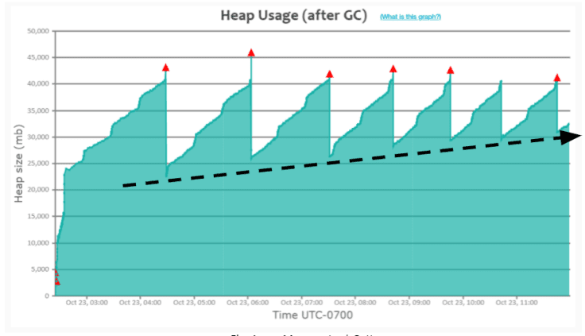

# app4

A sample app in golang for identifying and fixing memory leaks in a golang application using pprof. A common pattern in memory usage that indicates a memory leak in an application is the **"Sawtooth Pattern."** This pattern is observed in memory usage graphs over time. Here's how it typically looks and what it signifies:
* **Rising Peaks:** The memory usage increases steadily over time, indicating that the application is allocating more memory.
* **Sharp Drops:** These occur when the garbage collector (GC) runs, freeing up some of the allocated memory. However, not all memory is reclaimed.
* **Higher Baselines Over Time:** After each GC cycle, the baseline level of memory usage increases. This means that with each garbage collection, less memory is being freed, suggesting that some objects are not being released for GC.



In our sample application `/user` is an endpoint with memory leakage. The server stores data for each user in the UserCache. On every request to `/user`, new user data is created and added to the cache. However, there's no code to remove old user data from the cache.

Run following command to generate memory profile
```
go test -run=XXX -memprofile memory.prof -bench .
```

And then to analyse the memory profile run
```
go tool pprof -http=0.0.0.0:8888 memory.prof
```
